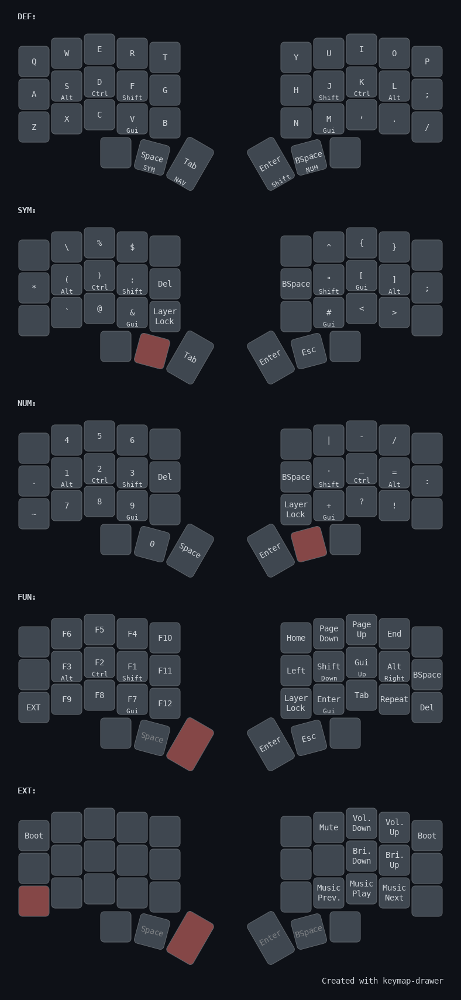

# Hydeik's Personal Keymap

My personal keymap for 34 keys with 5 layers with home-row mods.




##Features
- Home row modifiers and symbol/number layer tap-hold keys
- [Caps Word](https://docs.qmk.fm/features/caps_word) for capitalized word input
- [Layer Lock](https://docs.qmk.fm/features/layer_lock)
- [Repeat Key](https://docs.qmk.fm/features/repeat_key): context-aware key repetition


##Keymap Layers

There are 5 defined layers:

- BASE: QWERTY typing layout with home row mods
- SYM: Symbols and brackets
- NUM: Numbers and arithmetic operators
- FUN: Function keys, volume, brightness, media controls
- NAV: Arrow keys, navigation, undo/copy/paste, etc.

Layer structure is declared in `hydeik.h` using macros for readability and maintainability.


##Dependencies
- [QMK Firmware](https://qmk.fm/)
- [SM Tap Dance (sm_td)](https://github.com/stasmarkin/sm_td) - for reliable tap-hold behavior


##Build Firmware
Ensure your QMK environment is properly set up.

```bash
qmk clone <repository>
cd <keyboard_folder>
qmk compile -kb <keyboard_name> -km hydeik
```


To flash the firmware:

```bash
qmk flash -kb <keyboard_name> -km default
```

